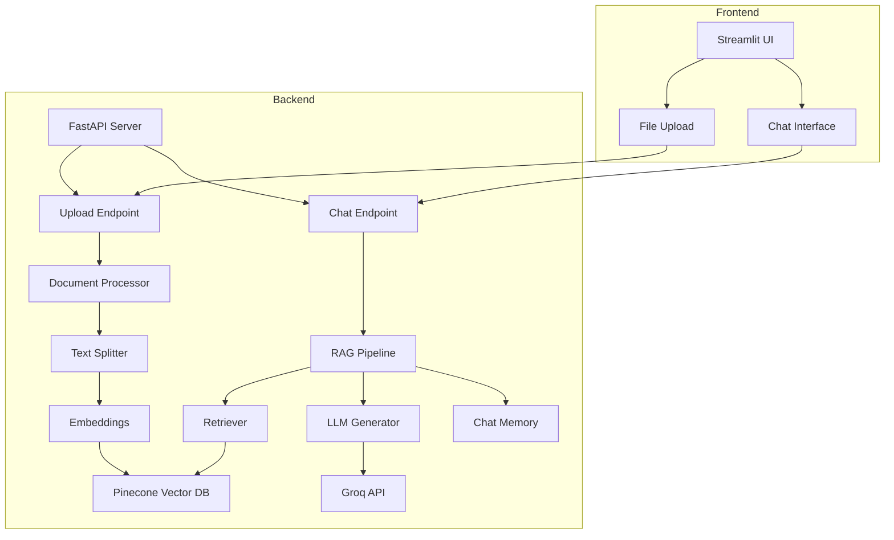

# 🤖 RAG End-to-End Project

A production-ready **Retrieval-Augmented Generation (RAG)** chatbot system built with FastAPI backend and Streamlit frontend. This application enables users to upload PDF documents and ask questions about them using advanced AI-powered retrieval and generation techniques.


---

## 📋 Table of Contents

- [Features](#-features)
- [Architecture](#-architecture)
- [Prerequisites](#-prerequisites)
- [Installation](#-installation)
- [Configuration](#-configuration)
- [Running the Application](#-running-the-application)
- [Usage Guide](#-usage-guide)
- [Project Structure](#-project-structure)
- [API Documentation](#-api-documentation)
- [Technologies Used](#-technologies-used)
- [Troubleshooting](#-troubleshooting)
- [Contributing](#-contributing)
- [License](#-license)

---

## ✨ Features

### Backend Features
- **FastAPI Framework**: Modern, fast, async REST API with automatic OpenAPI documentation
- **RAG Pipeline**: LangGraph-based retrieval and generation workflow
- **Vector Database**: Pinecone integration for efficient document embeddings storage
- **Intelligent Retrieval**: Semantic search using sentence transformers
- **LLM Integration**: Groq API for high-performance language model inference
- **Session Management**: Maintains conversation context across multiple interactions
- **Streaming Responses**: Real-time response streaming via Server-Sent Events (SSE)
- **Document Processing**: Automatic PDF parsing and intelligent text chunking
- **CORS Support**: Cross-origin resource sharing enabled for frontend integration

### Frontend Features
- **Streamlit UI**: Clean, intuitive web interface
- **PDF Upload**: Drag-and-drop document upload with processing feedback
- **Real-time Chat**: Interactive conversation interface with chat history
- **Session Management**: Create and manage independent chat sessions
- **File Deduplication**: Prevents duplicate document uploads
- **Backend Health Check**: Live status monitoring of backend service
- **Responsive Design**: Custom CSS styling for better user experience
- **Document Tracking**: View all uploaded documents with metadata

---

## 🏗️ Architecture



### Workflow

1. **Document Upload**: User uploads PDF → Backend processes and chunks text → Embeddings stored in Pinecone
2. **Question Asking**: User asks question → Retriever finds relevant chunks → LLM generates answer using context
3. **Session Management**: Each session maintains independent chat history and context

---

## 📦 Prerequisites

Before you begin, ensure you have the following installed:

- **Python**: Version 3.8 or higher
- **pip**: Python package installer
- **Git**: For cloning the repository (optional)

### Required API Keys

You'll need to obtain the following API keys:

1. **Groq API Key**: Sign up at [Groq Console](https://console.groq.com/)
2. **Pinecone API Key**: Create account at [Pinecone](https://www.pinecone.io/)
3. **Pinecone Environment**: Note your Pinecone environment (e.g., `us-east-1-aws`)

---

## 🚀 Installation

### 1. Clone the Repository

```bash
git clone https://github.com/youssefBedeer/RAG-End-to-End.git
cd RAG-End-to-End
```

### 2. Create Virtual Environment (Recommended)

**Windows:**
```bash
python -m venv .venv
.venv\Scripts\activate
```

**macOS/Linux:**
```bash
python -m venv .venv
source .venv/bin/activate
```

### 3. Install Dependencies

```bash
pip install -r requirements.txt
```

This will install all required packages including:
- FastAPI & Uvicorn (Backend server)
- LangChain & LangGraph (RAG framework)
- Streamlit (Frontend UI)
- Pinecone (Vector database)
- Groq (LLM API)
- And more...

---

## ⚙️ Configuration

### Environment Variables

Create a `.env` file in the project root directory:

```env
# API Keys
GROQ_API_KEY=your_groq_api_key_here
PINECONE_API_KEY=your_pinecone_api_key_here
PINECONE_ENVIRONMENT=your_pinecone_environment_here

# Backend Configuration
BACKEND_URL=http://localhost:8000

# Optional: Pinecone Index Configuration
PINECONE_INDEX_NAME=rag-documents
```

### Configuration Files

The project uses `backend/app/config.py` for centralized configuration management. You can customize:
- Model parameters
- Chunk sizes
- Embedding dimensions
- API timeouts

---

## 🏃 Running the Application

You need to run both the backend and frontend simultaneously in separate terminal windows.

### Terminal 1: Start the Backend Server

```bash
python -m uvicorn backend.app.main:app --reload
```

**Expected Output:**
```
INFO:     Uvicorn running on http://127.0.0.1:8000 (Press CTRL+C to quit)
INFO:     Started reloader process
INFO:     Started server process
INFO:     Waiting for application startup.
INFO:     Application startup complete.
```

The backend API will be available at:
- **API**: http://localhost:8000
- **API Docs**: http://localhost:8000/docs (Swagger UI)
- **ReDoc**: http://localhost:8000/redoc

### Terminal 2: Start the Frontend Application

```bash
streamlit run frontend.py
```

**Expected Output:**
```
You can now view your Streamlit app in your browser.

Local URL: http://localhost:8501
Network URL: http://192.168.x.x:8501
```

The frontend will automatically open in your default browser at http://localhost:8501

---

## 📖 Usage Guide

### Step 1: Upload Documents

1. Navigate to the sidebar on the left
2. Click on "Browse files" under "Document Management"
3. Select one or more PDF files
4. Wait for processing confirmation (you'll see the number of chunks created)

### Step 2: Ask Questions

1. Type your question in the chat input box at the bottom
2. Click "Send" or press Enter
3. Wait for the AI to retrieve relevant information and generate an answer
4. Continue the conversation - the system maintains context

### Step 3: Manage Sessions

- **View Session ID**: Check the sidebar for your current session identifier
- **Start New Session**: Click "🔄 Start New Session" to clear chat history and uploaded documents
- **Track Uploads**: See all uploaded documents with their chunk counts and timestamps

### Example Questions

After uploading a document, try asking:
- "What is the main topic of this document?"
- "Summarize the key points from section 3"
- "What does the document say about [specific topic]?"
- "Can you explain [concept] mentioned in the document?"

---

## 📁 Project Structure

```
RAG-End-to-End/
├── backend/
│   ├── __init__.py
│   └── app/
│       ├── __init__.py
│       ├── main.py                 # FastAPI application entry point
│       ├── config.py               # Configuration settings
│       ├── api/
│       │   ├── __init__.py
│       │   ├── chat.py            # Chat endpoint with streaming
│       │   └── upload.py          # Document upload endpoint
│       ├── rag/
│       │   ├── __init__.py
│       │   ├── pipeline.py        # RAG workflow orchestration
│       │   ├── retriever.py       # Vector retrieval logic
│       │   ├── generator.py       # LLM generation logic
│       │   └── embeddings.py      # Embedding models
│       └── memory/
│           ├── __init__.py
│           └── chat_history.py    # Session-based chat memory
├── frontend.py                     # Streamlit UI application
├── requirements.txt               # Python dependencies
├── .env                           # Environment variables (create this)
├── .gitignore                     # Git ignore rules
├── README.md                      # This file
└── SETUP.md                       # Quick setup guide
```

### Key Files Explained

- **`backend/app/main.py`**: FastAPI app initialization, CORS middleware, router inclusion
- **`backend/app/api/upload.py`**: Handles PDF upload, text extraction, chunking, and embedding
- **`backend/app/api/chat.py`**: Processes chat requests, retrieves context, generates responses
- **`backend/app/rag/pipeline.py`**: Orchestrates the RAG workflow using LangGraph
- **`backend/app/rag/retriever.py`**: Manages Pinecone vector database and similarity search
- **`backend/app/rag/generator.py`**: Interfaces with Groq LLM for answer generation
- **`backend/app/memory/chat_history.py`**: Maintains conversation history per session
- **`frontend.py`**: Complete Streamlit UI with upload, chat, and session management

---

## 🔌 API Documentation

### Base URL
```
http://localhost:8000
```

### Endpoints

#### 1. Health Check
```http
GET /
```

**Response:**
```json
{
  "status": "working"
}
```

#### 2. Upload Document
```http
POST /upload?session_id={session_id}
```

**Parameters:**
- `session_id` (query): Unique session identifier

**Request Body:**
- `file` (form-data): PDF file to upload

**Response:**
```json
{
  "filename": "document.pdf",
  "chunks": 42,
  "message": "Document processed successfully"
}
```

#### 3. Chat Stream
```http
POST /chat/stream?question={question}&session_id={session_id}
```

**Parameters:**
- `question` (query): User's question
- `session_id` (query): Unique session identifier

**Response:**
- Streaming text response (Server-Sent Events)

### Interactive API Documentation

Once the backend is running, visit:
- **Swagger UI**: http://localhost:8000/docs
- **ReDoc**: http://localhost:8000/redoc

---

## 🛠️ Technologies Used

### Backend Stack
| Technology | Purpose |
|------------|---------|
| **FastAPI** | Modern async web framework |
| **Uvicorn** | ASGI server for FastAPI |
| **LangChain** | LLM application framework |
| **LangGraph** | Workflow orchestration |
| **Pinecone** | Vector database for embeddings |
| **Groq** | High-performance LLM API |
| **Sentence Transformers** | Text embedding models |
| **PyPDF** | PDF text extraction |
| **Python-Multipart** | File upload handling |

### Frontend Stack
| Technology | Purpose |
|------------|---------|
| **Streamlit** | Interactive web UI framework |
| **Requests** | HTTP client for backend API |
| **Custom CSS** | Enhanced styling |

### AI/ML Components
- **Embeddings**: Sentence Transformers (all-MiniLM-L6-v2 or similar)
- **Vector Store**: Pinecone serverless
- **LLM**: Groq (Llama 3, Mixtral, or Gemma models)
- **Text Splitting**: LangChain RecursiveCharacterTextSplitter

---

## 🐛 Troubleshooting

### Common Issues and Solutions

#### 1. Backend Not Starting

**Error:** `ModuleNotFoundError: No module named 'backend'`

**Solution:**
```bash
# Ensure you're in the project root directory
cd RAG-End-to-End

# Run from project root
python -m uvicorn backend.app.main:app --reload
```

#### 2. Frontend Cannot Connect to Backend

**Error:** `❌ Cannot connect to backend at http://localhost:8000`

**Solution:**
- Verify backend is running in Terminal 1
- Check `BACKEND_URL` in `.env` file
- Ensure no firewall is blocking port 8000
- Try accessing http://localhost:8000 in your browser

#### 3. Upload Fails

**Error:** `❌ Upload failed: 500`

**Solution:**
- Check backend logs for detailed error
- Verify PDF file is not corrupted
- Ensure Pinecone API key is valid
- Check Pinecone index exists and is accessible

#### 4. No Responses from Chat

**Error:** Chat sends but no response appears

**Solution:**
- Ensure documents are uploaded first
- Check Groq API key is valid and has credits
- Review backend terminal for error messages
- Verify session ID matches between upload and chat

#### 5. API Key Errors

**Error:** `Unauthorized` or `Invalid API key`

**Solution:**
- Double-check API keys in `.env` file
- Ensure no extra spaces or quotes around keys
- Verify keys are active in respective dashboards
- Restart backend after updating `.env`

#### 6. Pinecone Connection Issues

**Error:** `PineconeException: Index not found`

**Solution:**
```python
# The backend creates the index automatically on startup
# If issues persist, manually create index in Pinecone dashboard:
# - Dimension: 384 (for all-MiniLM-L6-v2)
# - Metric: cosine
# - Name: rag-documents
```

### Debug Mode

Enable detailed logging by modifying `backend/app/main.py`:

```python
import logging
logging.basicConfig(level=logging.DEBUG)
```

### Getting Help

If you encounter issues not covered here:
1. Check the backend terminal logs
2. Review the browser console (F12) for frontend errors
3. Verify all dependencies are installed: `pip list`
4. Ensure Python version is 3.8+: `python --version`

---

## 🤝 Contributing

Contributions are welcome! Here's how you can help:

### Reporting Bugs
1. Check if the issue already exists
2. Create a detailed bug report with:
   - Steps to reproduce
   - Expected vs actual behavior
   - Error messages and logs
   - Environment details

### Suggesting Features
1. Open an issue describing the feature
2. Explain the use case and benefits
3. Provide examples if possible

### Pull Requests
1. Fork the repository
2. Create a feature branch: `git checkout -b feature/amazing-feature`
3. Commit your changes: `git commit -m 'Add amazing feature'`
4. Push to the branch: `git push origin feature/amazing-feature`
5. Open a Pull Request

### Development Guidelines
- Follow PEP 8 style guide for Python code
- Add docstrings to functions and classes
- Write unit tests for new features
- Update documentation as needed

---

## 📄 License

This project is licensed under the MIT License - see the [LICENSE](LICENSE) file for details.

---

## 🙏 Acknowledgments

- **LangChain** - For the excellent RAG framework
- **Pinecone** - For scalable vector database
- **Groq** - For fast LLM inference
- **Streamlit** - For rapid UI development
- **FastAPI** - For modern API framework

---

## 📞 Contact

**Project Maintainer**: Youssef Bedeer

- GitHub: [@youssefBedeer](https://github.com/youssefBedeer)
- Project Link: [RAG-End-to-End](https://github.com/youssefBedeer/RAG-End-to-End)

---

## 🚀 Future Enhancements

Planned features for future releases:

- [ ] Support for multiple document formats (DOCX, TXT, HTML)
- [ ] Advanced filtering and search capabilities
- [ ] User authentication and authorization
- [ ] Document versioning and history
- [ ] Export chat conversations
- [ ] Multi-language support
- [ ] Custom embedding model selection
- [ ] Batch document processing
- [ ] Analytics dashboard
- [ ] Docker containerization
- [ ] Cloud deployment guides (AWS, GCP, Azure)

---

## ⭐ Star History

If you find this project useful, please consider giving it a star on GitHub!

---

**Made with ❤️ using FastAPI, LangChain, and Streamlit**
